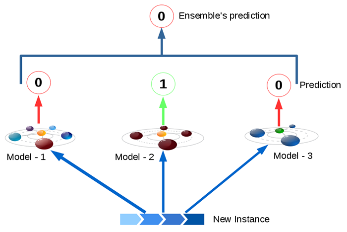
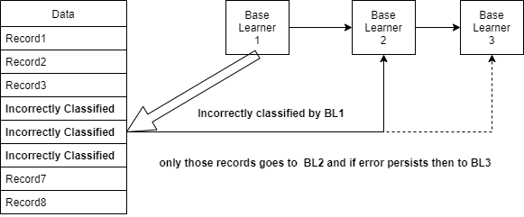

## Bagging-Boosting-Voting

* The three most popular methods for combining the predictions from different models are:

    * BAGGING : Building multiple models (typically of the same type) from different subsamples of the training dataset.
    * BOOSTING : Building multiple models (typically of the same type) each of which learns to fix the prediction errors of a prior model in the chain.
    * VOTING : Building multiple models (typically of differing types) and simple statistics (like calculating the mean) are used to combine predictions.
    
    
### VOTING :
* Building multiple models (typically of differing types) and simple statistics (like calculating the mean) are used to combine predictions.

* **Voting Classifier** Voting classifier has two types. Hard Voting Classifier and Soft Voting Classifier
* Voating Classicier works in Ensemble or RandomForest or in Deep Learning.
* Suppose in Random Forest classifier has two classes ***0*** and ***1*** and we have four Decision Trees **[D1,D2,D3,D4]** which gives the results- **[0, 1, 1, 1]**.
    * For **Hard Voting Classifier** the result would be ***1*** since the maximum models gives the output.
    * For **Soft Voting Classifier** it gives us the probablity. As shown in the below table, It take sthe higher probability scores.
    
| D | **1** | **0** |
|----|-------|-------|
| D1 | .95 | .05 |
| D2 | .86 | .14 |
| D3 | .7 | .3 |
| D4 | .6 | .4 |

* The result will be (.95+.86+.7+.6)/4 as it is huigher than the other one.

### Bagging( Bootstrap Aggrigation):

* One of the technique we use for Bagging is Random Forest
* Another approach is to use the same training algorithm for every predictor, but to train them on different random subsets of the training set. 
* When sampling is performed with replacement(Row sampling with replacement), this method is called bagging (short for bootstrap aggregating). 
* When sampling is performed without replacement, it is called pasting.
* When the results come from each models we use Voting on it to get the final result.
* The BaggingClassifier automatically performs soft voting instead of hard voting.

### Boosting

* Boosting (originally called hypothesis boosting) refers to any Ensemble method that can combine several weak learners into a strong learner. 
* **The general idea of most boosting methods is to train predictors(base learnears) sequentially, each trying to correct its predecessor.**
* There are many boosting methods available, but by far the most popular are **AdaBoost** (short for Adaptive Boosting) and **Gradient Boosting**.

### AdaBoost

* It consistes of Random Forest having Decision Trees with depth one (**one root with two leaves nodes**) 
* which is called **Stumps**(**Forest of Stumps**)

* The formula of **Sample Weight** is  

Here

          
* Where  <b><i>n<b><i> is the number of record

Step 2=
\]left \begin{array}
  &&f1& f2& f3 & O/p&Sample Weights& \\
  \hline
  0&...&...&...&Yes&1/7\\
  1&...&...&...&No&1/7\\
  2&...&...&...&Yes&1/7\\
  3&...&...&...&No&1/7\\
  4&...&...&...&No&1/7\\
  5&...&...&...&+&1/7\\
  6&...&...&...&+&1/7\\ 
 \end{array}\right

* Suppose record no 3 has been wrongly classified. 4 records result was correct and 1 was wrong.
* $Total Error(TE)= \frac {1}{7}$ 
* $Total Error(TE)= \frac {Number Of Errors}{Total Sample Weights}$ 

Step 3=
* **Performence of the Stump** = $\frac{1}{2}\log_e \Big( \frac {1-TE}{TE}\Big)$

$=$ $\frac{1}{2}\log_e \Big( \frac {1-\frac{1}{7}}{\frac{1}{7}}\Big)$

$=$ $\frac{1}{2}\log_e \Big(6\Big)$

$\therefore$ Performence Say =$0.895$ 

* **New Sample Weight**=
$Weight\times  e^{Perf Say}$

$=\frac{1}{7}\times e^{0.895}$

$\therefore The Output=0.349$

* In this point we need to update the weights and the formula like - $Weight\times  e^{-Pref Say}$
\begin{array}
  &&f1& f2& f3 & O/p&Sample Weights&Updated Weights&\\
  \hline
  0&...&...&...&Yes&1/7&0.05\\
  1&...&...&...&No&1/7&0.05\\
  2&...&...&...&Yes&1/7&0.05\\
  3&...&...&...&No&1/7&0.349\\
  4&...&...&...&No&1/7&0.05\\
  5&...&...&...&+&1/7&0.05\\
  6&...&...&...&+&1/7&0.05\\ 
 \end{array}

